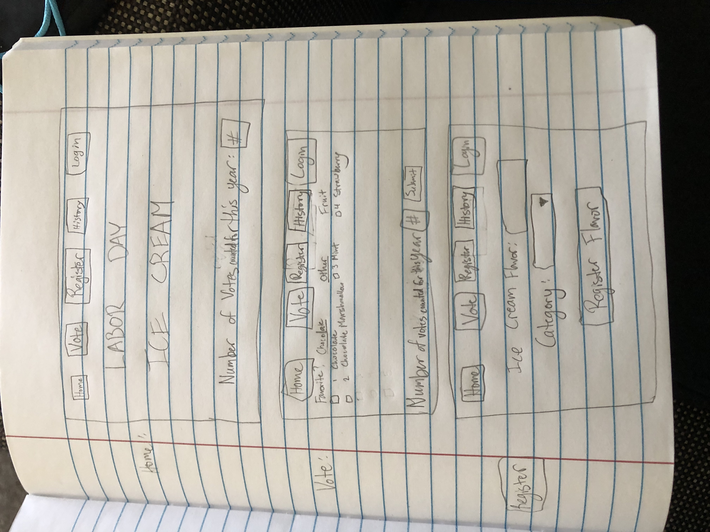
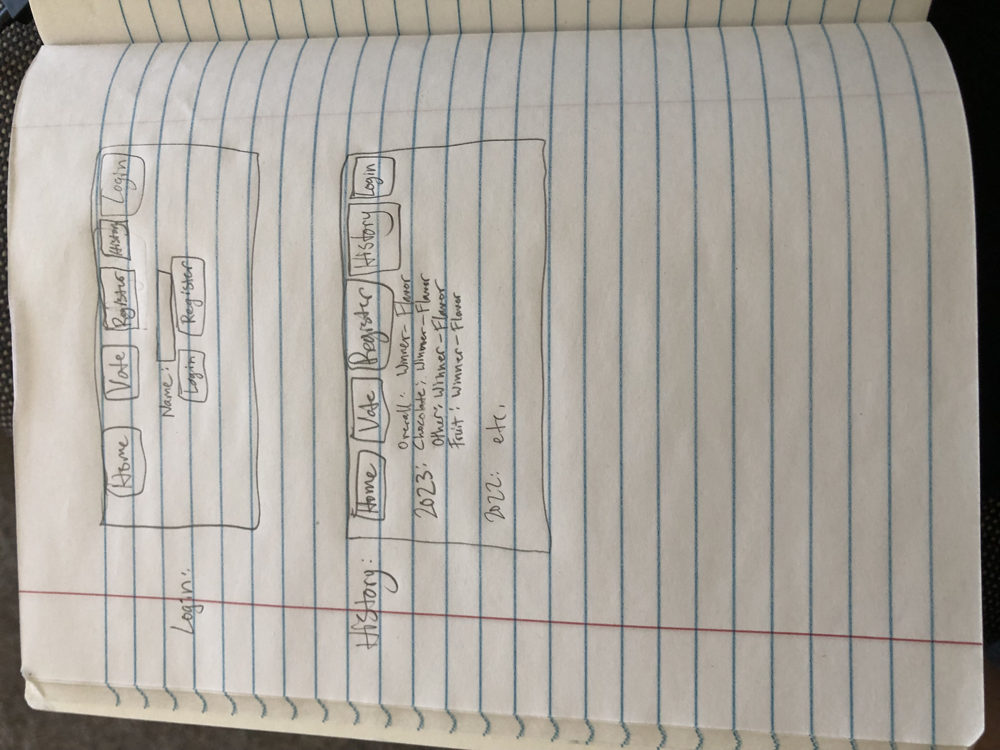

# Startup Application

## Startup Specification

### Elevator Pitch

Every year at our family Labor Day homemade ice cream contest, we fill out paper slips and write down our votes. This requires people to count the number of votes every year, which is a pain. However, if we had a website to vote on, we could have a website count and store the votes, making it much easier to decide who the winner is. On top of that, we could keep a history of who won what with which flavor. This would make our lives easier and make it possible to reflect on the past winning contestants and flavors. 

### Key Features

- Login system to securely login
- Number of votes for current year displayed in bottom
- Voting system to vote for favorite flavors
- Register System to register your ice cream flavor(s)
- History tab to see the past winners, overall and category

### Technologies

#### HTML
- HTML to render the page
- Links to other parts of page (Home, Vote, Register, History, Login)
- Lists for voting, inputs for registering
- Voting System

#### CSS
- Style the pages/buttons to make them look nice
- Have header with links to other parts of page
- Register/Vote buttons at bottom of page
- Number of votes at bottom of page

#### JavaScript
- Login system will login/register people
- Voting system will check to see if they have already voted, will store votes
- Register system will register ice cream flavors to the database

#### Authentication
- Login/Register system will have a page

#### Database Data
- Will store votes, ice creams, and winners
- Will store users and verify they only have one vote

#### Websocket Data
- The number of votes cast will dynamically be updated on the page

### Design Rough Draft

## HTML Deliverable
- HTML Pages: Added a home/index page, login page, voting page, register flavor page, and history page
- Links: There are links from any page to any other page
- Textual Content: There are various instructions and titles in the different pages (voting instructions, registering instructions, etc.)
- 3rd Party: A 3rd party quote about history on the history page
- Images: Image of ice cream on the home page
- Login Placeholder: Ask for first and last name on login page. I have a place holder there in a form
- Database Data: The various options to vote for will be the database data, as well as past entries on the history page
- Websocket: At bottom of vote page there are the total number of votes. At the bottom of register page, total number of flavors. On home page, total number of votes and flavors
- Various forms for registering flavors, voting, and logging in. All reroute to another page

## CSS Deliverable
- Header: Made the header/navigation bar Bootstrap, so looks nice
- Body: Made the body take up room that the header and footer don't use with flex. Also made various forms and inputs Bootstrap to make them look nicer
- Footer: Made a standard size that acknowledges use of Bootstrap and contains link to GitHub
- Navigation: As mentioned, Bootstrap navigation bar that links to other pages on site. Made dark-themed as well
- Responsive to window resizing: Bootstrap navigation and inputs respond to resizing. Everything is contained in either a flex or grid, so resizes properly
- Application Elements: Centered titles, added appropriate padding and margins, Bootstrap forms/inputs
- Application Text: Centered text where appropriate, made all text font standard to what Bootstrap uses, "Helvetica Neue"
- Application Images: Centered the image on the home page, that's the only image

## JavaScript Deliverable
- Login: I have a login page that on button click stores your name, redirects you to the home page, and displays your first name by the Login tab at the top.
- Database: I am storing the user, user flavors, amount of flavors and votes (this resets itself on each page, but I will be doing it differently when actually referring to database data), and the vote of the user in local storage. This will eventually be done in the database.
- WebSocket: I have a setInterval that triggers every few seconds to update the flavors and votes where applicable (resets on each page, but will change when actually getting database data and other user data).
- Application Logic: Login will redirect to homepage, when adding a flavor the flavor gets added to list on page to see what you have registered, voting page will store votes in local storage and redirect to the homepage. Grand prize section of voting can only be one of the flavors you voted for from the other categories, so webpage reflects this. Flavors populated from prescribed list in the JavaScript, but will be from the database. History clears the table and inserts the table for the correct year. Webpage will not allow voting or registering flavors until the user has logged in.

## Service Deliverable
- Create Service: Done
- Frontend Static Middleware: Done
- Frontend Third Party: Calls Quotable.io on history.html
- Backend Endpoints: /login post request endpoint temporarily stores users, /flavors/year gets you the flavors for that year, /flavors/year/user gets you the user's flavors for that year, /flavors is a post request to add a flavor and store it temporarily in memory, and /vote is a post request to place a vote and store it temporarily in memory. Right now just an array in index.js that I update with the posted information, then display it with the GET endpoints.
- Frontend Calls: login.html calls the login endpoint, register.html calls the user flavors for the year and the add flavor endpoints, vote.html calls the vote endpoint and the all flavors for year endpoint, and history.html calls the flavors for a given year endpoint.

## Database Deliverable
- MongoDB Atlas database creation: Done
- Endpoints for data: Endpoints previously using fake data now record the actual data and store it in the database. These endpoints include storing flavors, votes, and getting out flavors.
- Stores data in MongoDB: Done

## Login Deliverable
- New User: I have a registration button for new users that adds them to the database.
- Existing User: Login button that checks for the user in the database. That user can vote and register new flavors. 
- Credentials: These are in MongoDB (token, hashed password, etc.). Compares hashed password to the hashed entered password to verify correct credentials. Sets cookie for token.
- Restricts Application Functionality: Secure API routes prevent users without credentials to post information. I left the flavor list unsecure so anyone can see the list, but only authenticated users can vote and add flavors. There are also alerts and redirects if the user does not have a name in local storage or if they try to vote or register a flavor without a valid auth token.

## WebSocket Deliverable
When user adds new ice cream flavor, updates flavor count for all users
- Backend Listens: Done, listens for flavor message from other users to update flavor
- Frontend Listens: Done, sends message that says "flavor" to other users to notify them to update the flavor count
- Data sent over WebSocket: Sends the word "flavor", just because I didn't really need to send user specific information
- WebSocket data displayed: Updates a flavor counter on the user screen for all users when any user enters a new flavor