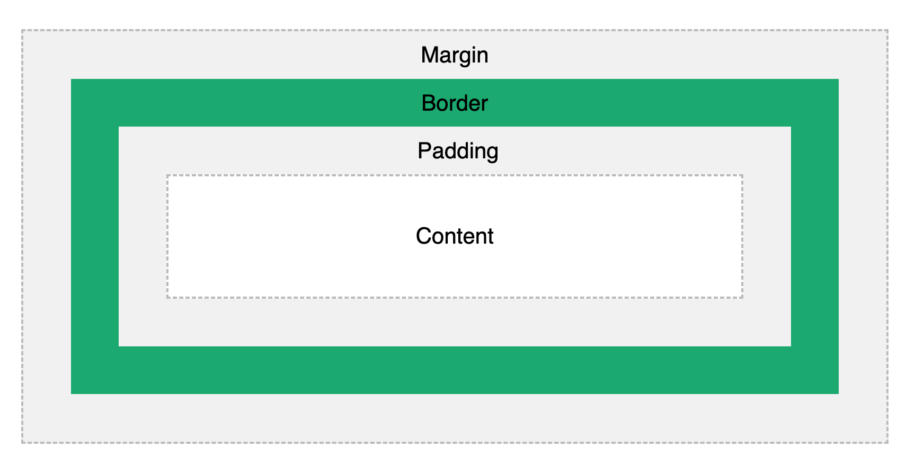

# Notes for CS260: Web Programming
Link to [README.md](https://github.com/SpencerYoung66/startup/blob/main/README.md)

### GitHub Notes:
- To resolve conflicts, I may need to configure my git first with `git config pull.rebase false` to have it merge on conflict. Then if they are in the same lines, I can proceed to check the file and decide on the merges from there.
- `git fetch` will get what changes are made without changing local repository
- Getting a fork from GitHub will get you a copy of the repository in your GitHub, then you can pull it to your development system.

### HTTPS Notes:
- Let's Encyrpt will dynamically check to make sure that the owner of the site is who they say they are, then they will issue a dynamically allocated/generated certificate

# Midterm Notes:
1. 
2. 
3. 
15. 
30. bozo.click is root, click is top level, banana.fruit is subdomain
32. DNS points to IP address for given domain name (cloudflare.com)
33. 443 - HTTPS, 80 - HTTP, 22 - SSH